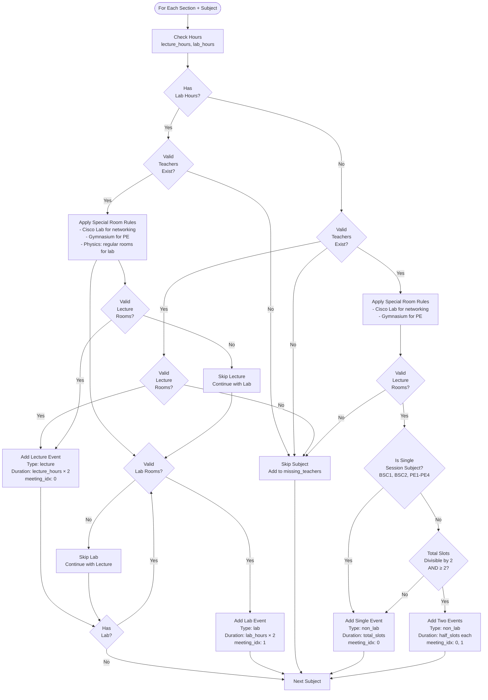
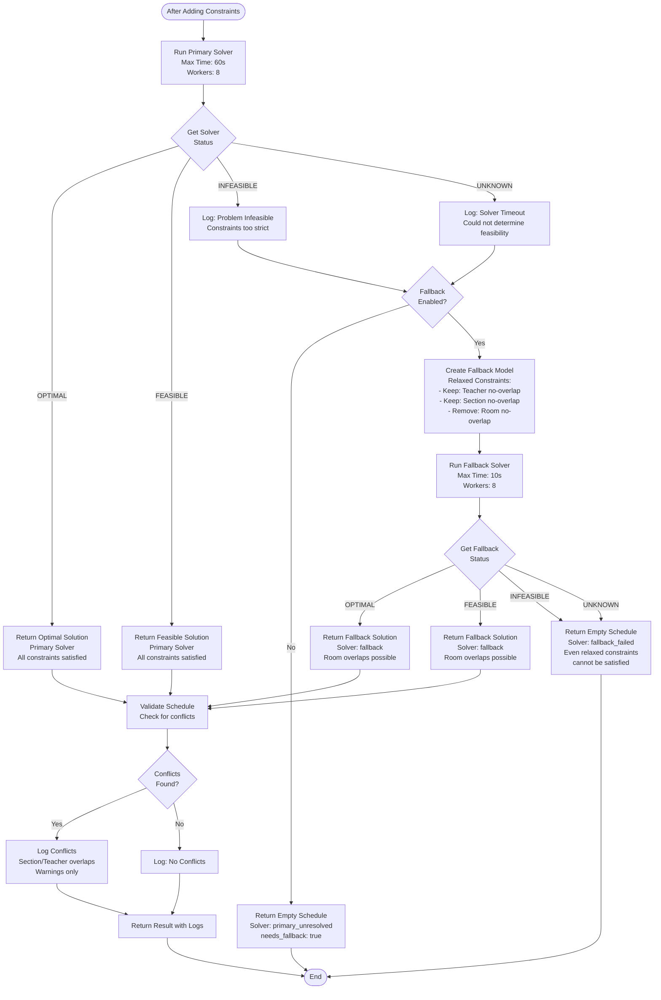

# Scheduler Algorithm Flowchart

## Main Algorithm Flow

```mermaid
flowchart TD
    Start([Start: generate_schedule]) --> Init[Initialize CP-SAT Model<br/>Create Logs Array]
    Init --> CleanData[Clean & Filter Data<br/>- Teachers: Remove invalid entries<br/>- Map subjects, teachers, rooms]
    
    CleanData --> CheckTeachers{Valid<br/>Teachers<br/>Available?}
    CheckTeachers -->|No| ReturnEmpty[Return Empty Schedule]
    CheckTeachers -->|Yes| DefineTimeSlots[Define Time Structure<br/>- Days: Mon-Sat<br/>- Time slots: 7AM-6PM<br/>- Day pairs: MW, TTh, FS]
    
    DefineTimeSlots --> GenSections[Dynamically Generate Sections<br/>Based on program_sections<br/>e.g., CS1A, CS1B, IT2A, IT2B]
    
    GenSections --> CheckSections{Sections<br/>Generated?}
    CheckSections -->|No| ReturnEmpty
    CheckSections -->|Yes| CreateEvents[Create Meeting Events<br/>For each section + subject]
    
    CreateEvents --> ProcessSubject{Process<br/>Each Subject}
    ProcessSubject --> CheckSubjectType{Subject<br/>Type?}
    
    CheckSubjectType -->|Lab Subject| CheckLabRooms{Has<br/>Lab Rooms?}
    CheckSubjectType -->|Non-Lab Subject| CheckLectRooms{Has<br/>Lecture Rooms?}
    
    CheckLabRooms -->|No| SkipLab[Skip Lab Component<br/>Continue with Lecture]
    CheckLabRooms -->|Yes| AddLabEvent[Add Lab Meeting Event<br/>- Type: lab<br/>- Duration: lab_hours × 2]
    
    CheckLectRooms -->|No| SkipSubject[Skip Subject]
    CheckLectRooms -->|Yes| CheckSingleSession{Is Single<br/>Session Subject?<br/>BSC1, BSC2, PE1-PE4}
    
    CheckSingleSession -->|Yes| AddSingleEvent[Add Single Meeting Event<br/>- Type: non_lab<br/>- Duration: lecture_hours × 2]
    CheckSingleSession -->|No| AddTwoEvents[Add Two Meeting Events<br/>- Type: non_lab<br/>- Duration: lecture_hours each<br/>- meeting_idx: 0, 1]
    
    AddLabEvent --> CheckLecture{Has<br/>Lecture?}
    CheckLecture -->|Yes| AddLectEvent[Add Lecture Meeting Event<br/>- Type: lecture<br/>- Duration: lecture_hours × 2]
    CheckLecture -->|No| ProcessSubject
    
    AddLectEvent --> ApplyRoomRules[Apply Special Room Rules<br/>- Cisco Lab: Networking subjects only<br/>- Gymnasium: PE subjects only<br/>- Physics: Regular rooms for lab]
    
    ApplyRoomRules --> AddEventToList[Add Events to meeting_events list]
    AddTwoEvents --> AddEventToList
    AddSingleEvent --> AddEventToList
    SkipLab --> CheckLecture
    SkipSubject --> ProcessSubject
    AddEventToList --> ProcessSubject
    
    ProcessSubject -->|All Done| CreateVars[Create Decision Variables<br/>For each meeting event:<br/>- assigned_starts: time slot<br/>- assigned_days: day<br/>- assigned_teachers_vars: teacher index<br/>- assigned_rooms_vars: room index<br/>- all_intervals: for no-overlap]
    
    CreateVars --> AddTeacherAvail[Add Teacher Availability Constraints<br/>Ensure teachers only assigned<br/>to available days]
    
    AddTeacherAvail --> AddConstraints[Add All Constraints]
    
    AddConstraints --> Constraint1[1. Teacher No-Overlap<br/>Same teacher cannot teach<br/>overlapping classes on same day]
    
    Constraint1 --> Constraint2[2. Room No-Overlap<br/>Same room cannot host<br/>overlapping events<br/>(except Gymnasium)]
    
    Constraint2 --> Constraint3[3. Section No-Overlap<br/>Same section cannot have<br/>overlapping classes]
    
    Constraint3 --> Constraint4[4. Same Teacher for Subject<br/>All meetings of same subject<br/>in same section use same teacher]
    
    Constraint4 --> Constraint5[5. Day Pairing Constraints<br/>- Lecture+Lab: On paired days MW/TTh/FS<br/>- Two non-lab: On paired days<br/>Based on teacher availability]
    
    Constraint5 --> SolvePrimary[Run Primary Solver<br/>- Max time: 60s<br/>- Workers: 8<br/>- Portfolio search]
    
    SolvePrimary --> CheckStatus{Primary Solver<br/>Status?}
    
    CheckStatus -->|OPTIMAL or FEASIBLE| ExtractPrimary[Extract Primary Solution<br/>Build schedule result]
    CheckStatus -->|INFEASIBLE or UNKNOWN| CheckFallback{Fallback<br/>Allowed?}
    
    CheckFallback -->|No| ReturnInfeasible[Return Infeasible Result<br/>with logs]
    CheckFallback -->|Yes| CreateFallbackModel[Create Fallback Model<br/>Relaxed constraints]
    
    CreateFallbackModel --> AddFallbackVars[Create Fallback Variables<br/>Same structure as primary]
    
    AddFallbackVars --> AddFallbackConstraints[Add Minimal Constraints<br/>- Teacher no-overlap<br/>- Section no-overlap<br/>- NO room no-overlap]
    
    AddFallbackConstraints --> SolveFallback[Run Fallback Solver<br/>- Max time: 10s<br/>- Workers: 8]
    
    SolveFallback --> CheckFallbackStatus{Fallback Solver<br/>Status?}
    
    CheckFallbackStatus -->|OPTIMAL or FEASIBLE| ExtractFallback[Extract Fallback Solution<br/>Build schedule result]
    CheckFallbackStatus -->|INFEASIBLE or UNKNOWN| ReturnFailed[Return Failed Result<br/>No schedule generated]
    
    ExtractPrimary --> ValidateSchedule[Validate Schedule<br/>Check for conflicts:<br/>- Section overlaps<br/>- Teacher overlaps]
    ExtractFallback --> ValidateSchedule
    
    ValidateSchedule --> Cleanup[Memory Cleanup<br/>Garbage collection]
    Cleanup --> ReturnSuccess[Return Schedule Result<br/>with logs and metadata]
    
    ReturnEmpty --> End([End])
    ReturnInfeasible --> End
    ReturnFailed --> End
    ReturnSuccess --> End
```

## Detailed Constraint Logic

```mermaid
flowchart TD
    Start([Start: Add Constraints]) --> TeacherOverlap[Teacher No-Overlap Constraint]
    
    TeacherOverlap --> ForEachPair1[For each pair of events i, j]
    ForEachPair1 --> CheckSameTeacher{Same<br/>Teacher?}
    CheckSameTeacher --> CheckSameDay{Same<br/>Day?}
    CheckSameDay -->|Both Yes| EnforceTimeSep[Enforce Time Separation<br/>Event i ends before j starts<br/>OR j ends before i starts]
    CheckSameDay -->|No| NextPair1[Next Pair]
    EnforceTimeSep --> NextPair1
    
    NextPair1 --> RoomOverlap[Room No-Overlap Constraint]
    RoomOverlap --> ForEachRoom[For each room]
    ForEachRoom --> IsGymnasium{Gymnasium?}
    IsGymnasium -->|Yes| SkipRoom[Skip - Allow Overlap]
    IsGymnasium -->|No| FindRoomEvents[Find all events<br/>using this room]
    FindRoomEvents --> CreateRoomIntervals[Create Optional Intervals<br/>for room assignments]
    CreateRoomIntervals --> AddNoOverlap[AddNoOverlap Constraint<br/>for room intervals]
    AddNoOverlap --> NextRoom[Next Room]
    SkipRoom --> NextRoom
    
    NextRoom --> SectionOverlap[Section No-Overlap Constraint]
    SectionOverlap --> ForEachPair2[For each pair of events i, j<br/>from same section]
    ForEachPair2 --> CheckSameDay2{Same<br/>Day?}
    CheckSameDay2 -->|Yes| EnforceTimeSep2[Enforce Time Separation<br/>Event i ends before j starts<br/>OR j ends before i starts]
    CheckSameDay2 -->|No| NextPair2[Next Pair]
    EnforceTimeSep2 --> NextPair2
    
    NextPair2 --> GroupBySubject[Group Events by<br/>section_id + subject_code]
    GroupBySubject --> SameTeacher[Same Teacher Constraint<br/>All events in group<br/>use same teacher]
    
    SameTeacher --> CheckGroupType{Group Type?}
    
    CheckGroupType -->|Lecture + Lab| DayPairing1[Day Pairing: Lecture+Lab<br/>- Lecture on day 1 of pair<br/>- Lab on day 2 of pair<br/>- Based on teacher availability]
    
    CheckGroupType -->|Two Non-Lab| DayPairing2[Day Pairing: Two Non-Lab<br/>- First meeting on day 1<br/>- Second meeting on day 2<br/>- Based on teacher availability]
    
    CheckGroupType -->|Single Event| NextGroup[Next Group]
    
    DayPairing1 --> CalcAvailPairs[Calculate Available Day Pairs<br/>Based on teacher availability:<br/>- MW if Mon+Wed available<br/>- TTh if Tue+Thu available<br/>- FS if Fri+Sat available]
    
    DayPairing2 --> CalcAvailPairs
    
    CalcAvailPairs --> EnforcePair[Enforce One Day Pair Selected<br/>Lecture/first on day 1<br/>Lab/second on day 2]
    
    EnforcePair --> NextGroup
    NextGroup --> End([End: All Constraints Added])
```



## Meeting Event Generation Logic



## Solver Decision Flow



## Key Algorithm Components

### 1. **Data Preparation Phase**
- Clean teacher data (remove invalid entries)
- Build maps (subjects, teachers, rooms)
- Filter by program, year level, semester
- Apply special room rules (Cisco Lab, Gymnasium, Physics)

### 2. **Event Generation Phase**
- Dynamically create sections based on `program_sections`
- For each section + subject combination:
  - **Lab subjects**: Create lecture + lab events
  - **Non-lab subjects**: Create 1 or 2 meeting events
  - **Single-session subjects**: Create 1 event (BSC1, BSC2, PE1-PE4)

### 3. **Variable Creation Phase**
- For each meeting event, create decision variables:
  - `assigned_starts`: Time slot index (0-22)
  - `assigned_days`: Day index (0-5 for Mon-Sat)
  - `assigned_teachers_vars`: Teacher index
  - `assigned_rooms_vars`: Room index
  - `all_intervals`: For no-overlap constraints

### 4. **Constraint Addition Phase**
- **Teacher no-overlap**: Same teacher can't teach overlapping classes
- **Room no-overlap**: Same room can't host overlapping events (except Gymnasium)
- **Section no-overlap**: Same section can't have overlapping classes
- **Same teacher**: All meetings of same subject in same section use same teacher
- **Day pairing**: Lecture+Lab and two non-lab meetings use paired days (MW/TTh/FS)

### 5. **Solving Phase**
- **Primary solver**: All hard constraints enforced
- **Fallback solver**: Relaxed constraints (no room overlap)

### 6. **Validation Phase**
- Check for section conflicts
- Check for teacher conflicts
- Log any issues found


